    

    <b>Automatic Architecture Diagrams from Code</b> 
    <a href="https://github.com/swark-io/swark">GitHub</a> • <a href="https://swark.io">Website</a> • <a href="mailto:contact@swark.io">Contact Us</a>

## Usage Instructions

1. **Render the Diagram**: Use the links below to open it in Mermaid Live Editor, or install the [Mermaid Support](https://marketplace.visualstudio.com/items?itemName=bierner.markdown-mermaid) extension.
2. **Recommended Model**: If available for you, use `claude-3.5-sonnet` [language model](vscode://settings/swark.languageModel). It can process more files and generates better diagrams.
3. **Iterate for Best Results**: Language models are non-deterministic. Generate the diagram multiple times and choose the best result.

## Generated Content
**Model**: GPT-4o - [Change Model](vscode://settings/swark.languageModel)  
**Mermaid Live Editor**: [View](https://mermaid.live/view#pako:eNqFlc1unDAQx18F-Zz0AfZQKWFb5dBGkdjkYnrwLrOsW7ARmKRRlHev7TGLv1A5sDPz_y2ewZ7hg5xkA2RHatGObLgUh30tCn1N8xEDd8OAkSD6xFqY1ri5HmQPJkyNYYFfIfATxGwBY-SAu6Oc1fNkGWsXz1OOK6VQ7LSQzsuwIJpM6qXsBylAqCj_R_Z6z0aqf3jLFJei0G608ncpFYwUfyLtAUZZwcn8kxq7cE6cPBsbam5rIhFxL-WfAzt2QI1VWHMTfoGGX5d94Q1srfskh7ljY8kUtHJ8p84vlkC8WWzSJZYXOFM0C2PHmXaypea2mZ7bHCzabZRx_rtLe6ZYenxMFI-PsZI3ayvhMFlsdbOwrsZxxsohpjBErJV9CpaEz3HlRdjWIRRn3oYPOzDevXHRoEYX17HJdk6qrCrHOi-PPsJf5Thjfvk95blv1Q8uFhKdFLyWYw00l84vbm-_ujbKCNg0GcFrnIwandsMce2XjOa3R0Y2RzETXg9_bjl9GJbKl5GWVB4IfuWBkFQeqJgcCt5oTNaKNX-5WEtWjIG49FgPXygywTxO0ktVP8FUTVJMEW-qbCHZPM3UtUW6UYLh6IS5d-_PErc511eDyDJBULVjcDkfXtzL1c8dAUTCxrfU9asb9HkorX0dxv0-XhVyQ3oYe8Yb_bX_qIm6QA812RU1aeDM5k7V5FND89Do2vec6UHVk50aZ7ghbFayehenxR_l3F7I7sy6CT7_Af5Siiw) | [Edit](https://mermaid.live/edit#pako:eNqFlc1unDAQx18F-Zz0AfZQKWFb5dBGkdjkYnrwLrOsW7ARmKRRlHev7TGLv1A5sDPz_y2ewZ7hg5xkA2RHatGObLgUh30tCn1N8xEDd8OAkSD6xFqY1ri5HmQPJkyNYYFfIfATxGwBY-SAu6Oc1fNkGWsXz1OOK6VQ7LSQzsuwIJpM6qXsBylAqCj_R_Z6z0aqf3jLFJei0G608ncpFYwUfyLtAUZZwcn8kxq7cE6cPBsbam5rIhFxL-WfAzt2QI1VWHMTfoGGX5d94Q1srfskh7ljY8kUtHJ8p84vlkC8WWzSJZYXOFM0C2PHmXaypea2mZ7bHCzabZRx_rtLe6ZYenxMFI-PsZI3ayvhMFlsdbOwrsZxxsohpjBErJV9CpaEz3HlRdjWIRRn3oYPOzDevXHRoEYX17HJdk6qrCrHOi-PPsJf5Thjfvk95blv1Q8uFhKdFLyWYw00l84vbm-_ujbKCNg0GcFrnIwandsMce2XjOa3R0Y2RzETXg9_bjl9GJbKl5GWVB4IfuWBkFQeqJgcCt5oTNaKNX-5WEtWjIG49FgPXygywTxO0ktVP8FUTVJMEW-qbCHZPM3UtUW6UYLh6IS5d-_PErc511eDyDJBULVjcDkfXtzL1c8dAUTCxrfU9asb9HkorX0dxv0-XhVyQ3oYe8Yb_bX_qIm6QA812RU1aeDM5k7V5FND89Do2vec6UHVk50aZ7ghbFayehenxR_l3F7I7sy6CT7_Af5Siiw)

```mermaid
graph TD
    subgraph App
        subgraph Pages
            HomePage[Home Page]
            MenuPage[Menu Page]
            AboutUsPage[About Us Page]
            ContactUsPage[Contact Us Page]
        end
        subgraph Components
            NavBar[Navigation Bar]
            Footer[Footer]
            HeroSection[Hero Section]
            Card[Card Component]
            BookTable[Book Table Component]
            VedioSection[Video Section]
            PopularCategory[Popular Category]
            MasterChef[Master Chef]
            Blog[Blog Component]
            ContactCard[Contact Card]
        end
        subgraph Data
            MenuData[Menu Data]
            CategoriesData[Categories Data]
            ChefsData[Chefs Data]
            BlogsData[Blogs Data]
            ContactData[Contact Data]
        end
        subgraph Config
            TailwindConfig[Tailwind Config]
            PostCSSConfig[PostCSS Config]
            NextConfig[Next.js Config]
            ESLintConfig[ESLint Config]
        end
    end

    HomePage --> NavBar
    HomePage --> Footer
    HomePage --> HeroSection
    HomePage --> PopularCategory
    HomePage --> BookTable
    HomePage --> VedioSection
    HomePage --> Card
    HomePage --> MasterChef
    HomePage --> Blog

    MenuPage --> NavBar
    MenuPage --> Footer
    MenuPage --> HeroSection
    MenuPage --> Card

    AboutUsPage --> NavBar
    AboutUsPage --> Footer
    AboutUsPage --> HeroSection
    AboutUsPage --> MasterChef
    AboutUsPage --> VedioSection

    ContactUsPage --> NavBar
    ContactUsPage --> Footer
    ContactUsPage --> HeroSection
    ContactUsPage --> ContactCard
    ContactUsPage --> VedioSection

    Card --> MenuData
    PopularCategory --> CategoriesData
    MasterChef --> ChefsData
    Blog --> BlogsData
    ContactCard --> ContactData

    TailwindConfig --> App
    PostCSSConfig --> App
    NextConfig --> App
    ESLintConfig --> App
```

